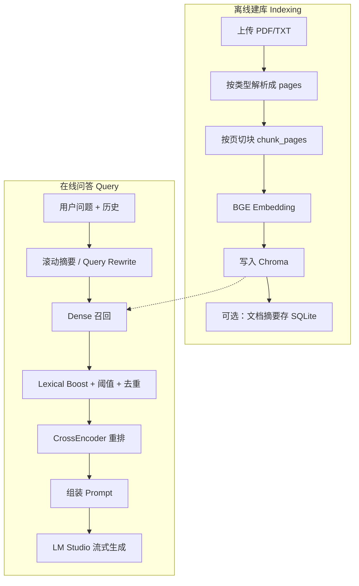
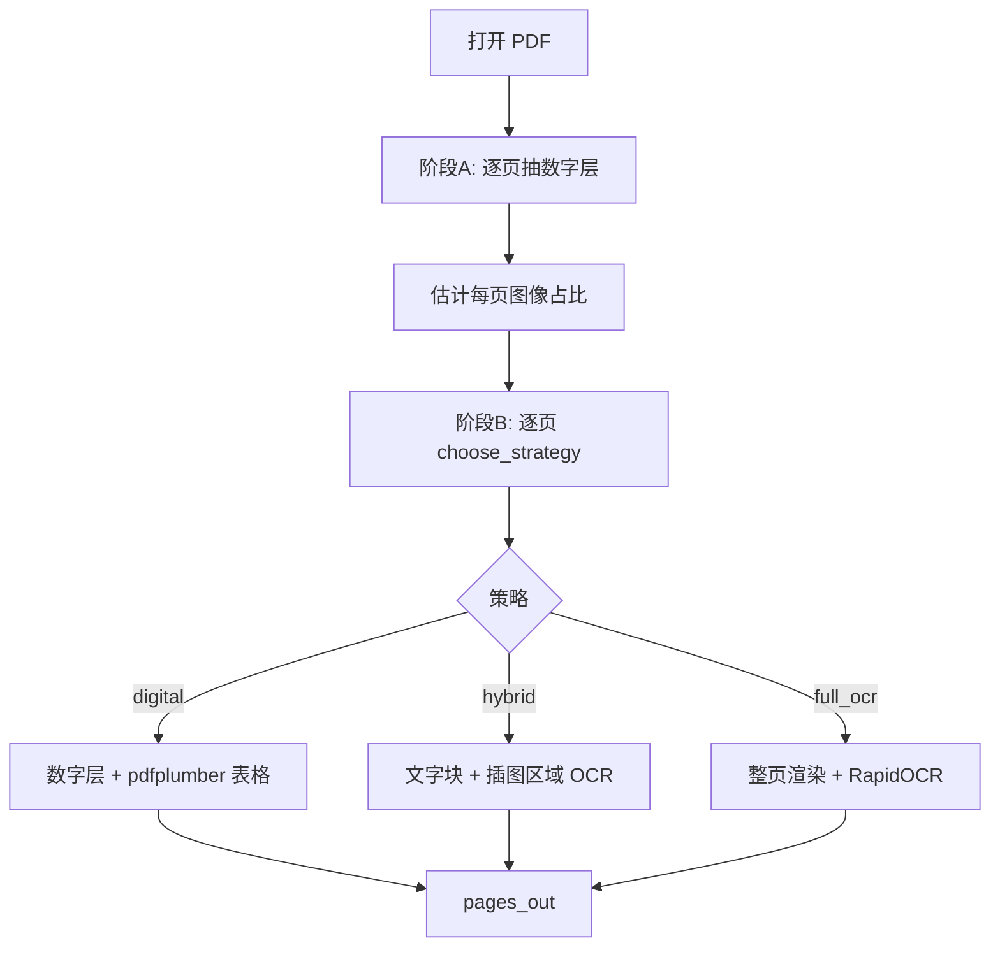
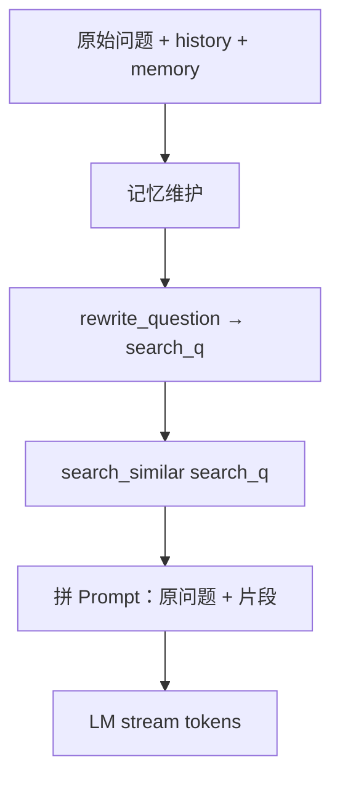

# SmartDoc AI · RAG 流程详解（面试深度版）

> 作者：Auto  
> 日期：2026-07-22  
> 重点：不同类型如何解析 → 如何切块 → 如何入库 → 如何召回/重排 → 如何生成  
> 源码主路径：`server-python/services/{parser,layout,chunker,embedder,vector_store,reranker,conversation_memory}.py`、`main.py`

---

## 总览：两条链路

RAG 在本项目里分成 **离线建库** 与 **在线问答**。



**检索与生成都在 Python**；Node 只做上传、会话、SSE 转发。

---

# 第一部分：离线建库

## 1. 输入与产出约定

| 阶段 | 输入 | 产出 |
|------|------|------|
| 解析 | 文件路径 + 原始文件名 | `pages: [{page, text}, ...]`，以及拼好的 `full_text` |
| 切块 | `pages` + `source_ext` | `chunk_items: [{text, page, kind, strategy}, ...]` |
| 向量化 | chunk 文本列表 | Chroma 记录：`id / embedding / document / metadata` |

支持扩展名（硬编码）：**仅 `pdf`、`txt`**。

---

## 2. 不同类型如何解析

入口：`iter_parse_events(file_path, originalName)` → 最终得到 `pages`。

### 2.1 TXT

流程极简：

1. 按常见编码读全文（失败则报错）
2. **整份文件当作 1 页**：`pages = [{page: 0, text: full}]`
3. `page=0` 的设计意图：TXT 没有真实页概念，后续入库强制 `page=0`，避免问答出现「第 N 页」

**不做 OCR、不做版面分析。**

### 2.2 PDF（两阶段流水线）



页数上限：`SMARTDOC_MAX_PDF_PAGES`，默认 **120**。

#### 阶段 A：数字层抽取

对每一页尽量拿到「可选中文本」+「表格」：

1. **优先 pdfplumber**
   - `extract_text()` → 数字层正文
   - 抽表 → `table_to_markdown()` 转成 Markdown 表（便于后续 RAG 检索）
2. **无 pdfplumber 则回退 PyMuPDF**
   - `get_text("text")`
3. 同时统计 **图像覆盖率**（页内图片面积 / 页面积），供策略判定

此时每页已有：`digital_text`、`tables_md`、`image_coverage`。

#### 阶段 B：版面分析 + 按页选策略

用 PyMuPDF 几何信息做轻量版面（`layout.analyze_page`），**不上深度学习版面模型**：

| 产出 | 含义 |
|------|------|
| `text_blocks` | type=0 文字块，带 bbox / 阅读坐标 |
| `image_regions` | 嵌入图区域；面积比 < 4% 的小图标忽略 |
| `max_image_ratio` | 最大单图占比 |
| 合并重叠图框 | IoU≥0.5 去重，减少重复 OCR |

**策略选择** `choose_strategy`（核心启发式）：

常量（`parser.py`）：

| 常量 | 值 | 含义 |
|------|----|------|
| `_TEXT_RICH_CHARS` | 80 | 数字层「够丰富」 |
| `_TEXT_SPARSE_CHARS` | 40 | 数字层「稀疏」 |
| `_IMAGE_COVER_SCAN` | 0.35 | 高图像占比（像扫描页） |
| `_IMAGE_COVER_EMPTY_PAGE` | 0.15 | 空白页但有图 |
| `NEAR_FULL_PAGE_RATIO` | 0.85 | 近整页大图 |
| `MIN_IMAGE_REGION_RATIO` | 0.04 | 值得单独 OCR 的插图下限 |

决策逻辑（按优先级）：

| 条件 | 策略 | 典型场景 |
|------|------|----------|
| 无字 + 图像覆盖 ≥15% | **full_ocr** | 纯扫描页 |
| 字数 <40 且覆盖 ≥35% | **full_ocr** | 扫描为主、几乎抽不出字 |
| 字数 <40 且最大单图 ≥85% | **full_ocr** | 整页大图扫描 |
| 字数 ≥80 且存在非整页插图 | **hybrid** | 正文可抽 + 图里还有字 |
| 有正文 + 有中等插图 | **hybrid** | 图文混排教材/幻灯 |
| 有数字层、无必要插图 OCR | **digital** | 正常文字 PDF |
| 无数字层但有局部图 | **hybrid** | 局部截图页 |
| 都没有 | **digital**（可能空页） | 空白 |

#### 策略执行细节

**① digital（仅数字层）**

- 合并：`数字层正文 + Markdown 表格`
- 不跑 OCR
- 最快，质量通常最好（原生 PDF）

**② full_ocr（整页扫描）**

1. 把该页渲染成图（约 2x scale）
2. RapidOCR 出文字；可选 RapidTable 出表 HTML → Markdown
3. `prefer_ocr=True` 合并：OCR 正文优先，表格合并；并对「已在表格里出现的 OCR 行」做去重，减少重复计分

**③ hybrid（图文混排）**

1. 取版面 `text_blocks`（没有则整页数字层当一块）
2. 对每个「非近整页」插图区域单独裁剪渲染 → OCR
3. 图内结果写成：`【图内文字 N】\n{ocr}`（这个标记后面会驱动 **structure 切块**）
4. 所有块按阅读顺序（先上后下、先左后右）合并，并做行级去重
5. 再拼上表格 Markdown

> 面试可说：我们不是「整本 PDF 一律 OCR」，而是 **按页自适应**：能数字层就数字层，混排只 OCR 插图，扫描页才整页 OCR，成本和质量更可控。

解析最终：`pages_out = [{page: 1..N, text: ...}, ...]`。空页不进列表。

---

## 3. 如何切块（Indexing 最关键的一环）

入口：`chunk_pages(pages, source_ext=...)`  
默认：`chunk_size=300`，`overlap=50`，`min_ratio=0.3`，`strategy=auto`。

### 3.1 总原则：**按页切，不跨页合并**

```text
for 每一页 page_text:
    page_mode = resolve_strategy(auto, sample=page_text, source_ext)
    units = chunk_text_units(page_text, strategy=page_mode)
    每个 unit 带上 page / kind / strategy
```

原因：PDF 页是天然语义边界；跨页硬拼容易把上下无关内容粘在一起，也破坏页码元数据。

### 3.2 策略选型 `resolve_strategy`

| 配置 | 行为 |
|------|------|
| 显式 `structure` / `recursive` | 强制该策略 |
| `auto` + `source_ext=txt` | **永远 recursive** |
| `auto` + PDF 某一页 | 该页文本匹配结构标记 → **structure**，否则 **recursive** |

**结构标记**（正则命中即认为本页有结构）：

- `【图内文字`
- `【表格` / `【图像表格`
- Markdown 表格行：`| ... |`

因此：**hybrid/full_ocr 产出的图内标记、表格 Markdown，会把该页切块切到 structure 路径**；纯文字页走 recursive。

### 3.3 策略 A：recursive（递归字符分块）

适用：TXT 全文、PDF 纯文字页。

思路对齐 LangChain `RecursiveCharacterTextSplitter`：

1. 分隔符从粗到细尝试：

```text
\n\n → \n → 。！？； → . ! ? ; → ，、 → 空格 → ""（硬切）
```

2. 用当前分隔符切开后，尽量合并小片，使每块 ≤ `chunk_size`
3. 仍超长 → 用更细一级分隔符递归
4. 最后一级硬切：步长 `chunk_size - overlap`
5. **递归过程中不叠 overlap**，切完后统一 `_apply_overlap`：下一块前缀带上上一块尾巴，且保证最终 `len(chunk) ≤ chunk_size`
6. `_merge_tiny_chunks`：长度 < `chunk_size * 0.3` 的碎块并入相邻块，避免极短无意义片段

**输出 kind**：全部为 `text`。

### 3.4 策略 B：structure（结构感知切块）

适用：含表格 / 图内文字标记的页。

步骤：

1. **`_iter_structural_units`**：按行扫描，拆成单元
   - 连续 `|` 开头行 → `kind=table`（整表尽量聚在一起）
   - `【图内文字 N】` / `【表格】` 标题块 → `kind=figure` 或 `table`
   - 其余正文缓冲 → `kind=text`
2. **`_pack_units`**：
   - **table**：过长则按行再切，尽量不切断表头语义；仍超长再硬切
   - **figure / text**：按中英文句号等切句，再用 `_pack_sentence_stream` 装箱到 ≤300；块间可带 overlap
3. **`_merge_tiny_units`**：同 `kind` 的过短单元合并；**不跨** table/figure/text 合并

**设计动机（面试点）**：

- 表格若用纯 recursive，容易从单元格中间切断，检索时语义破碎
- 图内 OCR 文本用标记包住，作为独立 figure 单元，避免和正文混切

### 3.5 切块产出示例（概念）

```json
[
  {"text": "……正文……", "page": 3, "kind": "text", "strategy": "recursive"},
  {"text": "| 列A | 列B |\n| --- | --- |\n| 1 | 2 |", "page": 4, "kind": "table", "strategy": "structure"},
  {"text": "【图内文字 1】\n图中识别出的字……", "page": 4, "kind": "figure", "strategy": "structure"}
]
```

---

## 4. Embedding 与向量入库

### 4.1 模型与非对称编码

| 用途 | API | 是否加指令前缀 |
|------|-----|----------------|
| 文档块入库 | `embed_documents(texts)` | **否**，原文编码 |
| 用户查询 | `embed_query(q)` | **是**，前缀：`为这个句子生成表示以用于检索相关文章：` |

模型：`BAAI/bge-small-zh-v1.5`  
统一 `normalize_embeddings=True`（L2 归一化），便于余弦/内积式检索。

> 面试点：BGE 官方推荐 **query 加 instruction、document 不加**，形成非对称双塔。

### 4.2 写入 Chroma

- 路径：`data/chroma_db`，collection 名 `documents`
- 批大小 **20**：`embed → collection.add`
- 同 `doc_id` **先 `delete_doc_vectors` 再写**，防重复上传脏数据
- 取消中途：若已写入则回滚删除

每条记录：

| 字段 | 内容 |
|------|------|
| `id` | `{doc_id}_chunk_{i}` |
| `embedding` | 向量 |
| `document` | chunk 原文 |
| `metadata.doc_id` | 文档 UUID（检索 where 过滤） |
| `metadata.chunk_index` | 全局序号（摘要拼全文用） |
| `metadata.page` | TXT 强制 0；PDF 为页码 |
| `metadata.kind` | text / table / figure |
| `metadata.source_ext` | pdf / txt |

距离空间：创建 collection 时代码未强制指定；运行时读 `hnsw:space`，缺省按 **l2** 把 distance 转成越大越好的 score（单位向量上约 `1 - d²/2`）。

### 4.3 摘要（旁路，不进检索主路径）

入库完成后 Node 调 `/ai/summarize-doc`：按 `chunk_index` 拼全文 → map-reduce 摘要 → 存 SQLite。  
失败不影响后续 RAG 提问。

---

# 第二部分：在线问答（Retrieval → Generation）

## 5. Ask 流水线逐步拆解

入口：`POST /ai/ask` → `sse_ask`。



注意两个「问题」：

| 变量 | 用途 |
|------|------|
| `search_q` | 只用于向量检索 / 重排 |
| `req.question` | 进最终 user Prompt，回答围绕原问 |

---

## 6. 对话记忆如何服务 RAG

模块：`conversation_memory.py`

### 6.1 最近 N 轮 + 滚动摘要

- 默认保留 **5 轮**原文（环境变量钳在 4～6），约 `2N` 条消息
- 更早消息：增量压进 `memory_summary`（≤1200 字）
- `memory_covered`：已压缩到历史第几条，避免每轮重复压缩

### 6.2 Query Rewrite（检索专用）

输入：原问题 + 摘要 + 最近对话  
输出：一句独立可检索的中文问句（补全「这个/上面那个」等指代）  
失败 / 过长 → 回退原问题。

### 6.3 进生成 Prompt 的历史

`build_history_prompt_messages`：

1. 有摘要 → 额外一条 system：「以下是更早多轮对话的压缩摘要…」
2. 再追加 recent 的 user/assistant 原文

---

## 7. `search_similar`：召回后处理全链路

这是 RAG 检索核心，顺序固定。

### Step 0：定两个 k

```text
final_k = resolve_top_k(doc)          # 最终给模型几段，约 2～5
fetch_k = resolve_recall_k(doc, final_k)  # Chroma 初召回多少
```

**`final_k`（按文档总块数自适应）**：

| 文档块数 | final_k（默认 MIN=2 MAX=5） |
|----------|-----------------------------|
| ≤12 | 2 |
| ≤60 | 3 |
| ≤200 | 4 |
| >200 | 5 |

**`fetch_k`（初召回）**：

```text
floor = max(final_k×3, 8)
target = max(floor, final_k×5, ceil(块数×0.12))
fetch_k = min(50, 块数, target)   # 小文档块数≤floor 时直接全召回
```

> 关系：召回池大小随文档变；**进模型条数不随「召回了多少」线性放大**，而由 final_k 夹住。

### Step 1：Dense 召回

1. `query_embedding = embed_query(search_q)`（带 BGE 指令）
2. `collection.query(n_results=fetch_k, where={doc_id})`
3. distance → `dense_score`（越大越好）

### Step 2：Lexical Boost（词面加分）

```text
score = min(1.0, dense_score + lexical_boost)
```

| 规则 | boost |
|------|-------|
| 归一化后 query 整段出现在 chunk | +0.55 |
| 去标点 query（≥4 字）出现在 chunk | +0.50 |
| 4 字滑动窗口命中率 ≥40% | +0.35 |
| SequenceMatcher ≥0.25 | +min(0.3, ratio×0.5) |

**动机**：短问（如题干关键词）对整页长 chunk，纯向量分可能偏低；词面命中直接抬分。

### Step 3：阈值过滤 + 空结果兜底

默认阈值 0.15；小文档（块数≤10）0.05；开重排时预过滤再放宽到约 ≤0.12。

兜底（可用性优先）：

1. 阈值把结果滤光，但 Chroma 有返回 → **强制保留 top 候选**
2. Chroma query 空、但该 doc 库里有块 → **get-all + 纯 lexical 打分**

### Step 4：去重 `_dedupe_chunks`

相似度阈值默认 **0.72**（归一化空白后：相等 / 包含 / SequenceMatcher）。  
重叠窗口切块很常见，不去重会导致 Prompt 里同一事实出现多次，诱导模型复读。

### Step 5：按候选数收紧 `final_k`

候选不足时允许少于 MIN，不强行凑满。

### Step 6：CrossEncoder 重排

| 项 | 说明 |
|----|------|
| 模型 | `BAAI/bge-reranker-base` |
| 输入 | `(query, chunk_text)` 对 |
| 分数 | raw logit → **sigmoid** |
| 池子 | 去重后最多 `fetch_k` 条 |
| 输出 | 截断到 `final_k`；`score` 变重排分，保留 `dense_score` |
| min_score | 默认 0（只排序不滤空） |
| 降级 | 未预热 / 异常 → dense 顺序截断 |

**面试对比**：

| | Bi-Encoder（召回） | Cross-Encoder（重排） |
|--|-------------------|----------------------|
| 速度 | 快，可对全库近似 | 慢，只打小候选池 |
| 精度 | 一般 | 看 query-doc 交互，更准 |
| 本项目角色 | Chroma ANN + lexical | 精排 top 2～5 |

---

## 8. Prompt 组装与生成

检索结果 → 编号上下文（**不再贴页码标注**）：

```text
【片段1】
{chunk text}

【片段2】
...
```

messages：

1. system：文档问答规则（覆盖要点、禁止复读、不要标页码…）
2. （可选）摘要 system + recent 历史
3. user：文档片段 + **原始用户问题** + 收尾指令

生成：LM Studio，`temperature=0.3`，`max_tokens=800`，带 frequency/presence penalty（不支持则去掉），**真 SSE** 逐 token 下发。

`sources` 仍可带 page 元数据给前端，但 Prompt 明确要求答案不写「第 N 页」。

---

# 第三部分：端到端串讲（面试口述稿）

可以按这个顺序讲 2～3 分钟：

1. **解析分流**：TXT 整文件一页；PDF 先抽数字层与图像占比，再按页选 digital / hybrid / full_ocr，表格转 Markdown，图内 OCR 打 `【图内文字】` 标记。  
2. **切块分流**：按页不跨页；TXT 与纯文页用递归字符切（300/50）；有表/图标记的页用 structure，保护表格与图文块。  
3. **入库**：BGE-small 非对称编码，L2 归一化进 Chroma，metadata 带 doc_id/page/kind。  
4. **提问**：滚动摘要 + rewrite 只服务检索；Dense 召回自适应 recall_k；dense+lexical 打分；去重；BGE reranker 精排到 2～5 段。  
5. **生成**：片段进 Prompt，原问题作答，流式输出；多层空结果兜底保证「库里有就能问到」。

---

# 第四部分：参数速查 & 源码入口

## 关键默认参数

| 项 | 默认 |
|----|------|
| chunk_size / overlap | 300 / 50 |
| 碎块合并比 | 0.3 |
| TOP_K_MIN / MAX | 2 / 5 |
| RECALL 上限 / 比例 | 50 / 0.12 |
| SIM 阈值 | 0.15（小文档 0.05） |
| 去重相似度 | 0.72 |
| 重排 | 开，bge-reranker-base |
| 历史轮数 | 5（4～6） |
| Embedding | bge-small-zh-v1.5 |
| PDF 页上限 | 120 |

## 源码地图

| 步骤 | 文件 |
|------|------|
| 解析 / OCR | `services/parser.py` |
| 版面策略 | `services/layout.py` |
| 切块 | `services/chunker.py` |
| Embedding | `services/embedder.py` |
| 检索 / 去重 / top_k | `services/vector_store.py` |
| 重排 | `services/reranker.py` |
| 记忆 / rewrite | `services/conversation_memory.py` |
| 入库 SSE + Ask SSE | `main.py` |

---

## 附录：三类 PDF 页走哪条路（对照表）

| 页面类型 | 解析策略 | 切块策略 | 原因 |
|----------|----------|----------|------|
| 可复制纯文字 | digital | recursive | 数字层足够，按段落/句号切即可 |
| 文字 + 插图有字 | hybrid | 常为 structure | 图内标记触发结构切块 |
| 扫描件/大图 | full_ocr | 多为 recursive（无表标记时）或 structure（有表/图标记） | 先 OCR 成文本再切 |
| TXT | 整文件 page=0 | recursive | 无页、无版面 |
